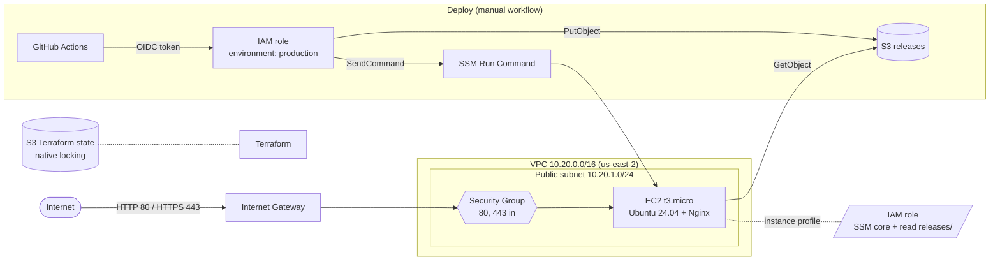

# AWS DevOps Infrastructure Lab

[](https://github.com/estennio/aws-devops-infrastructure-lab/actions/workflows/validate.yml)

A small, fully Terraform-managed AWS stack that serves a static site over HTTPS, with keyless GitHub Actions deployment and rollback.

## Summary

I wanted to practice the full path from an empty AWS account to a verified HTTPS endpoint, without the console. I built a custom VPC and an Ubuntu EC2 instance in `us-east-2`, all as Terraform, with Nginx and TLS 1.3 configured on first boot. A GitHub Actions deployment over OIDC and SSM Run Command (no SSH, no stored AWS keys) deploys a commit after manual approval, and I tested its automatic rollback by making a deploy fail on purpose. CI validates every change.

**Stack:** AWS (VPC, EC2, IAM, S3, SSM), Terraform, GitHub Actions, Nginx, Bash.

## Architecture



## What I built

- **Infrastructure as code:** the VPC, subnet, routing, Security Group, EC2 and IAM are all in [`infra/terraform/`](infra/terraform/). A from-scratch apply created 14 resources; [plan, outputs and live checks](evidence/artifacts/terraform/) are committed.
- **Remote state:** a separate [bootstrap module](infra/bootstrap/) creates the S3 state bucket (versioned, encrypted, TLS-only); the main stack uses S3 native locking.
- **Network:** one public subnet behind an Internet Gateway, with HTTP/HTTPS open and SSH off by default ([`network.tf`](infra/terraform/network.tf), [`security.tf`](infra/terraform/security.tf)).
- **Security (configured in Terraform):** IMDSv2 required, encrypted root volume, least-privilege IAM, validated Terraform inputs, no secrets in the repository ([`compute.tf`](infra/terraform/compute.tf), [`github-oidc.tf`](infra/terraform/github-oidc.tf)).
- **TLS:** Nginx serves HTTPS with TLS 1.3 negotiated on the current instance, using the self-signed certificate (`CN`/`SAN` `web.lab.test`) that [`bootstrap.sh`](scripts/bootstrap.sh) generates ([evidence](evidence/artifacts/terraform/05-server-evidence.txt)). The earlier console-built instance used a laboratory Root CA; that chain is historical only.
- **First-boot configuration:** `user_data` clones this repository and runs the idempotent [`scripts/bootstrap.sh`](scripts/bootstrap.sh); I recorded HTTP and HTTPS `200 OK`, an `Online` SSM node, `nginx -t`, the 80/443 listeners and a server evidence run over SSM Run Command on the resulting instance ([evidence](evidence/artifacts/terraform/)).
- **CI:** [`validate.yml`](.github/workflows/validate.yml) runs `terraform fmt`, `validate` and TFLint on both Terraform roots, ShellCheck and a Trivy config scan on every PR. Every action is pinned to a commit SHA, and [Dependabot](.github/dependabot.yml) proposes updates for actions and Terraform providers.
- **Deploy with rollback (verified):** [`deploy-ssm.yml`](.github/workflows/deploy-ssm.yml) uploads a SHA-addressed release to S3, activates it on the instance through SSM, validates HTTP/HTTPS from the runner, and rolls back on failure ([design](docs/04-versioned-deployment.md)). Each run waits for approval on the `production` environment. A deploy, a deliberate failure that rolled back, and a redeploy are recorded with SSH disabled ([runs and transcript](evidence/README.md#oidc-and-ssm-deployment-runs)).

## Key decisions

- **SSM instead of SSH for deployment**, because the runner then needs no open port 22, no key and no host-key secret. The role is limited to `AWS-RunShellScript` on this one instance.
- **OIDC instead of an AWS access key**, because there is nothing long-lived to leak or rotate. The trust policy is pinned to this repository by its immutable GitHub ID and to the `production` environment.
- **Environment-pinned trust instead of a branch name**, because the environment can require reviewers and restrict deployments to `main`, so a pull request cannot get credentials.
- **No NAT Gateway, load balancer or database**, because a single public instance meets the goal and those services dominate the cost of a lab ([scope decisions](docs/01-architecture.md)).
- **Atomic symlink switch instead of copying files in place**, because `mv -T` over `current` swaps releases in one step and keeps the previous release for rollback ([versioned deployment](docs/04-versioned-deployment.md)).
- **Inline, justified Trivy suppressions instead of a global ignore file**, because each accepted finding (for example, SSE-S3 instead of a customer-managed KMS key) is documented next to the resource it applies to ([`infra/bootstrap/main.tf`](infra/bootstrap/main.tf)).

## How to run

Needs Terraform ≥ 1.11, the AWS CLI with credentials, and PowerShell. Both steps create billable resources; applying is your decision.

```powershell
# 1. Create the remote state bucket (local state, one time)
cd infra\bootstrap
Copy-Item terraform.tfvars.example terraform.tfvars   # set a globally unique state_bucket_name
terraform init
terraform apply

# 2. Create the lab
cd ..\terraform
Copy-Item backend.hcl.example backend.hcl             # set the bucket name from step 1
terraform init "-backend-config=backend.hcl"
terraform plan -out tfplan
terraform apply tfplan
```

Variables, import of existing resources, the OIDC deploy setup and cost notes: [`infra/terraform/README.md`](infra/terraform/README.md).

## Lessons learned

- **A reload is not a restart.** My first migration to the versioned layout rolled itself back with a 404, although the new Nginx configuration was correct. `systemctl reload nginx` only signals the master process and returns at once, so the check that ran right after it reached an old worker still serving `/var/www/html`. Retrying the check for a few seconds fixed it, and the second run passed on its second attempt.
- **Read what the cloud actually received.** The first deploy was denied `sts:AssumeRoleWithWebIdentity` even though the trust policy matched GitHub's documentation as I knew it. CloudTrail showed the real OIDC subject: for repositories created after July 2026, GitHub includes the owner and repository IDs. I matched those IDs exactly instead of using a wildcard, because a wildcard would accept a recycled repository name.
- **A rollback only counts once it has run.** I made the external validation fail on purpose by pointing it at `127.0.0.1`. The release activated on the instance, the check failed, the workflow rolled back through SSM, and the site served the previous commit again. Before that test, the rollback was only code.
- **Removing SSH changed the whole deploy path.** With no port 22 and no stored key, every server action goes through IAM and SSM. The permissions became explicit (one instance, one SSM document, one S3 prefix), and each action leaves a record in CloudTrail and in the SSM command history.

## Limitations and next steps

- **Single instance, single AZ:** no redundancy, no load balancer, no database. This is intentional for a lab.
- **TLS is not publicly trusted:** the current instance uses a self-signed certificate for `web.lab.test`, so clients report a verification error and no CA chain is claimed. A public domain and certificate are a possible next step.
- **Do not re-run `bootstrap.sh` after the migration:** it reinstalls the legacy Nginx site, which serves `/var/www/html` instead of the `current` release. Making the bootstrap aware of the versioned layout is a possible next step.
- **SSH deploys are history only:** the earlier GitHub Actions workflows that deployed over SSH were removed once the SSM path had recorded runs. Their successful runs stay linked in the [evidence index](evidence/README.md).
- **Console-era evidence:** the SSH, Session Manager, Root CA and TLS screenshots come from the earlier console-built instance that Terraform replaced and are kept as history. SSH and the Root CA chain were not re-verified on the current instance. Its evidence is in [`evidence/artifacts/terraform/`](evidence/artifacts/terraform/). Evidence is a record, not a live check; see the [evidence index](evidence/README.md).
- **Read the docs for detail:** [architecture](docs/01-architecture.md), [verification](docs/02-deployment-and-verification.md), [server bootstrap](docs/03-server-bootstrap.md), [versioned deployment](docs/04-versioned-deployment.md), [repository guide](docs/05-repository-guide.md).
